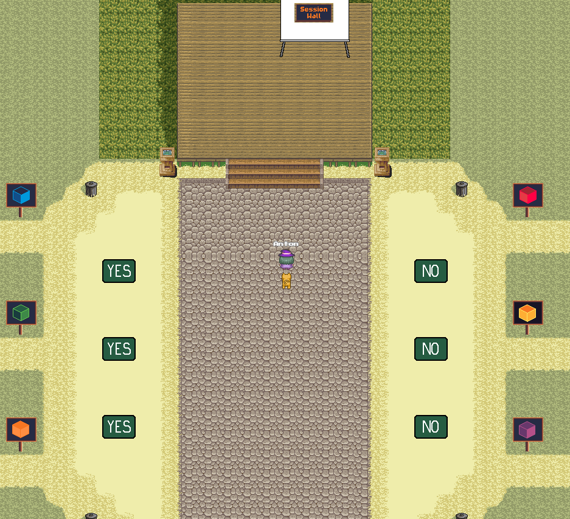

# Welcome to the BarCamp at DATE!

Just a few hints on how to survive in this environment:
* You are in arena - the entry point of BarCamp world. Move around with the arrow keys and explore the map. Some popups at the bottom of the screen will help with for e.g. submitting topics
* If you go close to another avatar, a video chat opens and you can start talking

* In arena are Jitsi and Miro sessions, where you can interact with others

* In the voting area shown below, we can vote by moving our avatars to the yes or no areas

* The meeting rooms for the BarCamp sessions are color coded, just follow the signs

* Of cause, you can have a coffee with your collegues at the coffee rooms. Just follow:

# Proposing a topic
If you want to propose a topic, please download the template at:

After you filled it, please send it to us using the mailboxes in the arena:

